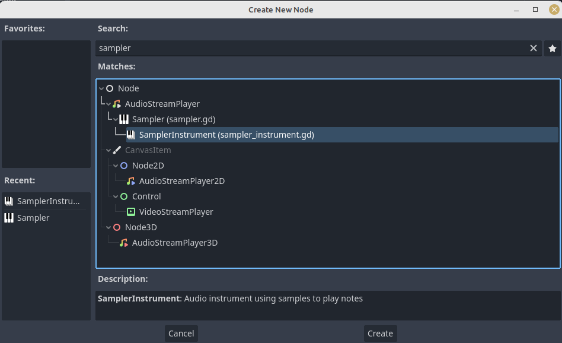
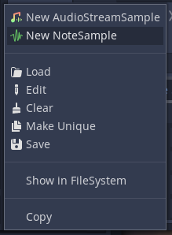
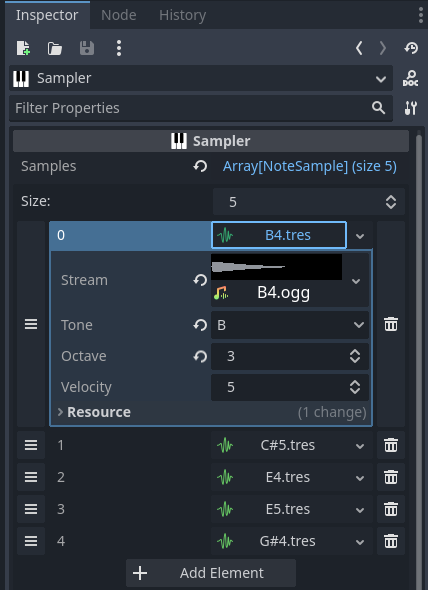

# Simple Sampler

_Simple Sampler_ is a plugin for Godot for creating musical samplers in a game. Basically it allows you to play any musical note from a set of sound samples. Useful for making generative, interactive or procedural music, or for dynamic sound effects!

This is the tool I built for my game [Bazza Nava](https://itooh.itch.io/bazza-nava), which is a great showcase of what you can do with it. There is also a small demo in the plugin repository. Chek out its scene and source code to quickly see how to use the samplers!

## Installing

Copy the `addons/SimpleSampler` folder and put it in your project at the path `addons/SimplerSampler`. Then open _Project > Project Settings_ and go to the _Plugins_ tab. You should see the plugin Simple Sampler in the list. Activate it to use it in your project.

## Usage

### Basics

_SimpleSampler_ gives you access to two new Nodes: **Sampler** and **Multisampler**.



They work both the same way. They are musical instruments that take several sound samples as input, and can then play any note by calculating the sample to play and the pitch to apply. They aim to be as easy to use as possible!

To configure a Sampler, you need to register its note samples. For this, you must provide your own sound files (see the section below to know where you can find some). Each file must correspond to a single note. Of course, you don't need to have a file for every possible note (that would be too heavy)! Usually, having three samples per octave gives great results. Files can be single sounds, or loops, depending on how you import them. Samplers work well with .wav or .ogg!

Once you have your samples, you must add them to the Sampler, in the _samples_ array. _Simple Sampler_ provides a Resource to manage samples: **NoteSample**.



Add one of them for each sample files you have.

**:warning: Warning**: Godot will also propose to select _AudioStreamSample_. _Do not use that type of resource here!_ It will definitely not work. The reason it appears is because of an issue that prevents typing correctly resources. Hopefully it will be fixed in Godot 4.0.

For each sample, you must enter 3 properties:

* The sound file (Stream)
* Corresponding note (Tone)
* Corresponding octave (Octave)



You must do this for every samples. The order you put them in the array doesn't matter. If you want to go faster, you can save NoteSample as resources. This allow you to use them elsewhere!

Once you have done that, your sampler is ready to use! To play a note, just call the function `play_note` with the note name (in uppercase) and the octave.

```
sampler.play_note("C", 4)
```

And that's it!

Also note that samplers are based on _AudioStreamPlayers_. Which means that you can set their volume or connect them to an audio bus just like any AudioStreamPlayer.

:warning: Don't edit their volume or runtime though, as it is used by the sampler's envelop. Use a bus instead for these kind of dynamic effects.

If your sample is played on a loop, and you want to stop it, call the `release` method:

```
sampler.release()
```

### Multisamplers

As said above, Multisamplers work exactly like samplers. The main difference is that they are able to play several notes at a time. This can be useful for playing chords, but also for overlapping notes with long reverb or delay (although it is preferable to use _AudioEffect_ on buses when possible instead of having them directly in the sound files)!

Multisampler has an additional parameter on top of Sampler's ones: _Max Notes_. This determines how many simultaneous notes the multisampler can play. If you go beyond that number, the first note played will be replaced.

Multisampler has exactly the same methods as Sampler. To play a chord, simply call `play_note` several time:

```(gdscript)
# C minor 7
sampler.play_note("C")
sampler.play_note("Eb")
sampler.play_note("G")
sampler.play_note("A#")
# When omitting the octave parameter, the default value is 4
```

Calling `release` will release every currently playing note.

### Envelop

_Sampler_ and _Multisampler_ have a simplified sound envelop system to customize the sound of the instrument. It consists of three parameters: _Attack_, _Sustain_ and _Release_. Their default value is -1, meaning that they are not active.

* *Attack* is the length (in seconds) of a fade-in at the beginning of the sound. If negative, the sound will play immediately at its default volume.
* *Sustain* is the length (in seconds) of the sound after the attack. Once this delay is passed, it will automatically call `release`. If negative, the sound will play entirely or in loop.
* *Release* is the length (in seconds) of a fade-out once `release` has been called, either manually or after the sustain. If negative, the sound will stop immediately.

You can use those to have more dynamic instruments (with looping sounds), or if you find the length of your sample too long (using _sustain_ and _release_ allows you to interrupt it earlier).

### Note Value Calculator

For a more advanced use, you can access the class *NoteValueValculator* used by the samplers:

```
var calculator: NoteValueCalculator = get_node("/root/NoteValue")
```

This tool converts notes into number values, and reciprocally. It can be useful if you want to do some arithmetic manipulation with the notes! Here are the functions it provides:

* `get_note_value(note: String, octave: int = 4) -> int` returns the value of a note, where C0 is 0.
* `get_note_name(value: int) -> String` returns the name of a note given its value
* `get_note_octave(value: int) -> int` returns the octace of a note given its value

Those tools come in handy if you want to make procedural music based on mathematics and music theory!

## Where can I find samples?

There are multiple places on the web where you can find audio samples for all kind of instruments. Here are some websites that provides free samples of great quality:

* **[Philarmonia Orchestra](https://philharmonia.co.uk/resources/sound-samples/) :** A collection of samples from the Philarmonia Orchestra's instruments. Comes with several length and variations (piano, forte, pizzicato, etc…)
* **[FreePats project](http://freepats.zenvoid.org/index.html) :** A bank of free virtual instruments. A lot of them are available in the _SFZ_ format, meaning you have access to the WAV files.
* **[Karoryfer lecolds](https://www.karoryfer.com/karoryfer-samples) :** A libray of sampled instruments. Most of them are not free, but you can still find some good ones at the end of the page that are under Creative Commons License.

There are surely plenty other places where you can find or purchase great sound samples. You can also make your own! As you've seen, you don't actually need a lot of them to make a sampler. So you can use the musical tool of your choice, play a bunch of notes, and make your own sample files!

Also, you can save and share your own samplers between projects (or even users!), either by saving _NoteSample_ resources, or a Godot scene with a _Sampler_ as root.
